# Group Project 1

### Examining Bitcoin correlations. Is Bitcoin an uncorrelated asset?

Bitcoin has sporadically tracked with various indexes since it's inception but it never seems to last. Our group wanted to examine these relationships by asking - Does Bitcoin have any interesting price correlations with the SP500, a tech ETF (IYW), gold, oil or..... avocados? Is it truly an uncorrelated asset? Could Google searches for Bitcoin predict a change in price?

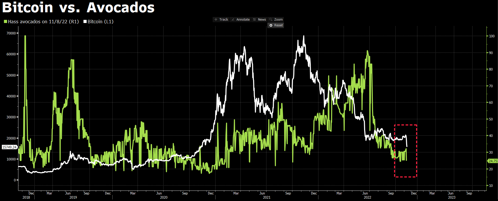

### What do different Bitcoin correlation charts reveal?

Ultimately, we were searching for a significant price change in Bitcoin that correlates to movements in other indexes, commodities or Google searches.

### Can correlation analysis give us any insight into whether Bitcoin returns are arbitrary?

Modern portfolio theory seeks to add uncorrelated assets to a portfolio to improve returns and reduce risk. Are Bitcoin returns truly arbitrary and not related to the global economy? Do prices go up during broad speculative bubbles and down when those bubbles pop? Or is Bitcoin like gold, a somewhat arbitrary store of value that is not tied to corporate earnings and central bank policy? Can something that is in limited supply be valuable just because people think it is?

### Team Members:
 - Wade Burgess
 - Greg Stevenson
 - Faith Kuny

### Analysis
Using csv files created with GoogleFinance and Pytrends (an interface to download Google trends), we cleaned 8 years of closing price data for:

 - Bitcoin
 - S&P 500 ETF (SPY)
 - IShares US Technology ETF (IYW)
 - Gold
 - Oil (West Texas Intermediate)
 - Avocados
 - Google searches for "Bitcoin"
 
 
Reading data and cleaning was done in a Jupyter Notebook using Pandas, Numpy, Python, Hvplot, Matplotlib and Plotly Express. Once dataframes were made for all variables, we concatenated them into one dataframe:

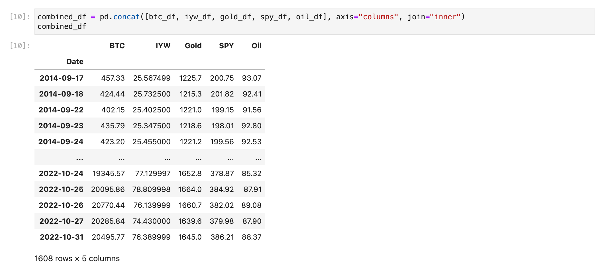

After finding the percentage change from this dataframe, we graphed it with the following result:

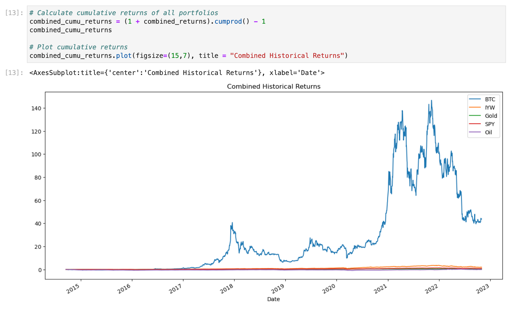

Bitcoin's returns over a 8 year period clearly outperformed our comparisons, and little else could be determined from this graph. However, when we did a correlation analysis, we could see that even if Bitcoin's returns didn't correlate with any of our comparables, the price movements clearly do. 

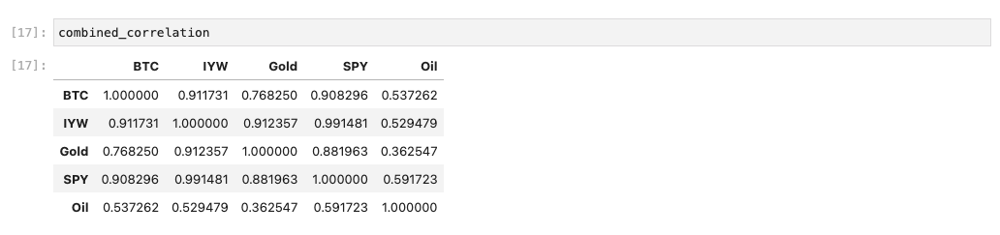

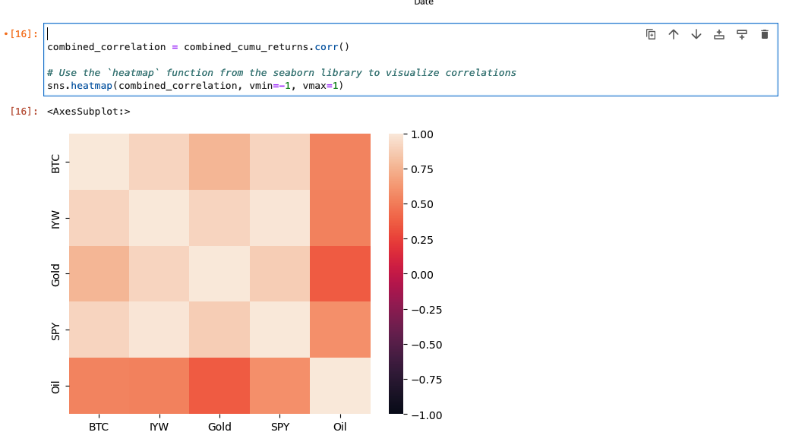

With price movements that correlate .91 and .90 with IYW and SPY, we can hypothesize that perhaps Bitcoin's price movements are influenced by global financial markets and central bank policy in our timeframe. 

Zooming into smaller time periods can be misleading, as in this graph where Bitcoin seemed to correlate with oil, although we know from our 8 year analysis that this did not last:

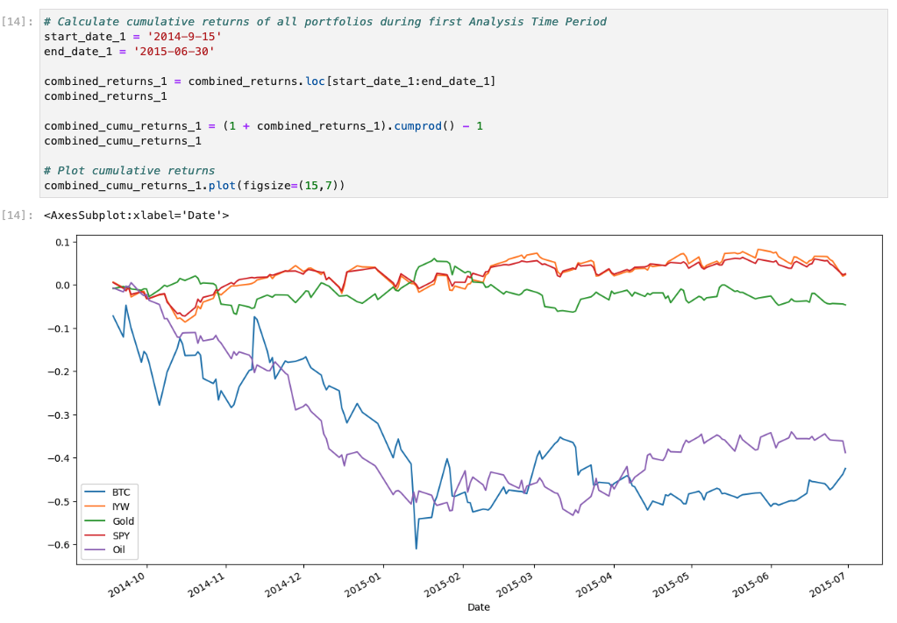

And here we zoomed in on Bitcoin's 2019 bullrun, where everything else seemed relatively flat and Bitcoin's price is extremely volatile:

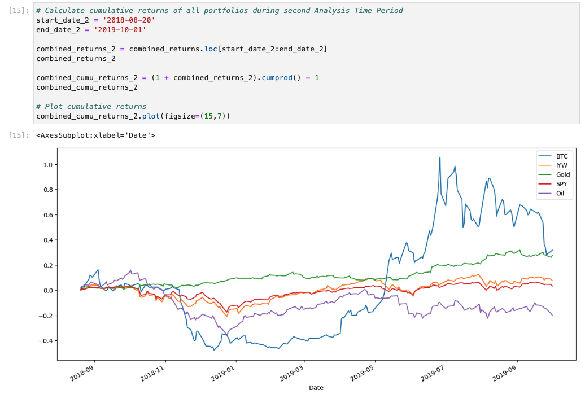

Still searching for some sort of correlation that could produce a trading strategy, we narrowed in on Google searches for "Bitcoin" using Pytrends:

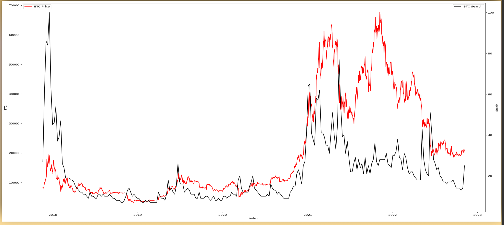

We observed from this image that every time "Bitcoin" searches spike, this price seems to go down predictably over the next 3-4 days. We did not observe any spikes in searches for "Bitcoin" that resulted in immediate appreciation.

### Trading Strategy

We focused on the last three years of Bitcoin search data to construct a trading strategy. In that window, "Bitcoin" searches on Google doubled in 24 hours a total of 6 times. Each time, the price of Bitcoin fell in the 3-4 days following. If a short position was taken when "Bitcoin" searches doubled and closed within the next 3-4 days, each presented a window of opportunity for profit ranging between 5% to 38.3%. A detailed graph of "Bitcoin" searches, bitcoin closing price and bitcoin low in the 6 windows of opportunity follows:

#### Window 1
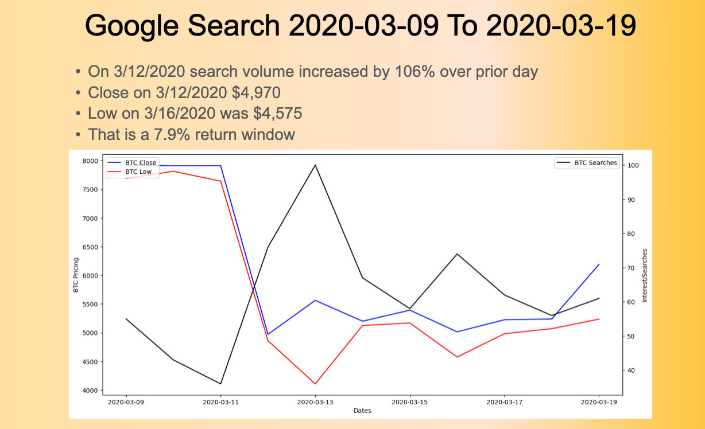

#### Window 2
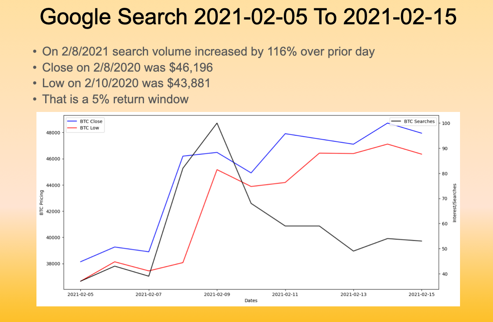

#### Window 3
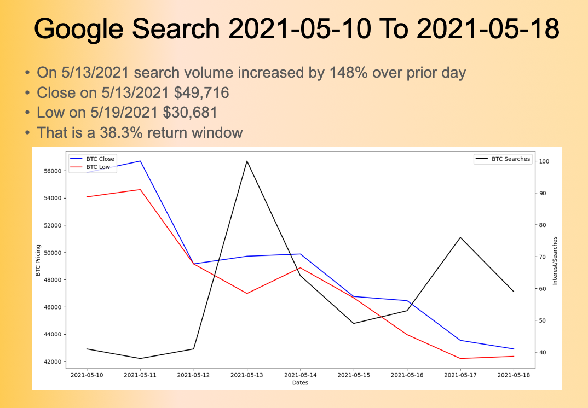

#### Window 4
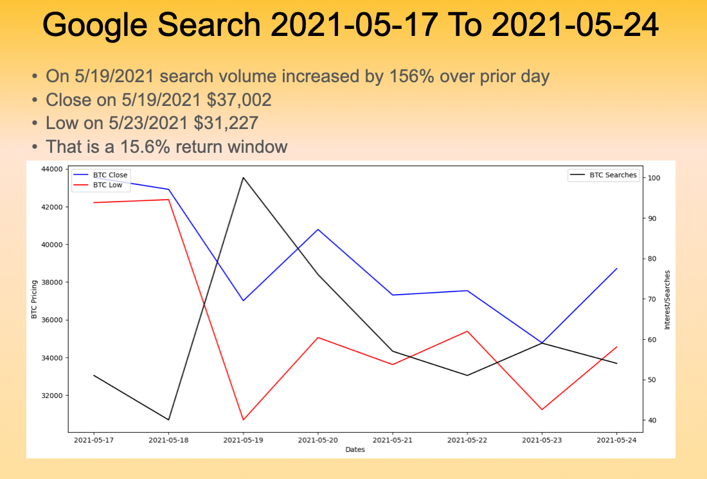

#### Window 5
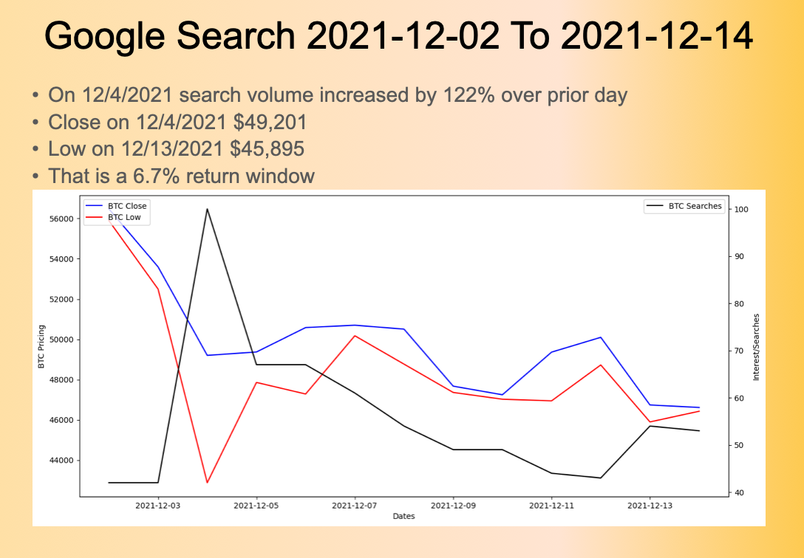

#### Window 6
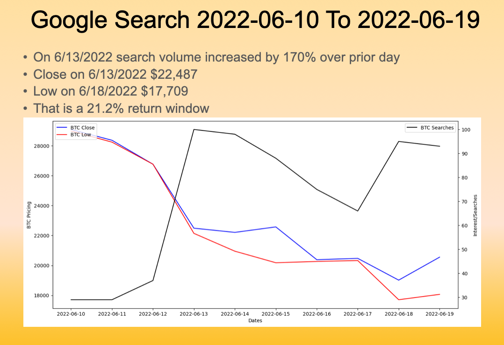

### Conclusions

Our research indicated that the price of Bitcoin is correlated with the Sp500 and technology stocks, but not the returns, and it is not an uncorrelated portfolio investment. However, there does seem to be a pattern with Google searches for Bitcoin and it would be possible to create a trading algorithm to short Bitcoin every time searches spike, closing out the positions over the next few days. With the prevalence of trading algorithms, we know it is probable that these already exist, and could be exacerbating the trend, if many large short positions are taken every time Bitcoin makes headlines.

### Additional Research

If we were to continue with this research, we would spend more time on the analysis for the 6 data points we have for when searches doubled. We would also see if the trend applied to smaller spikes in searches. More research could be done on related searches such as "Coinbase" and "Binance" to see if bitcoin's price has a predictable reaction after these searches spike. One concern is how quickly and reliably you can access Pytrends data. 

