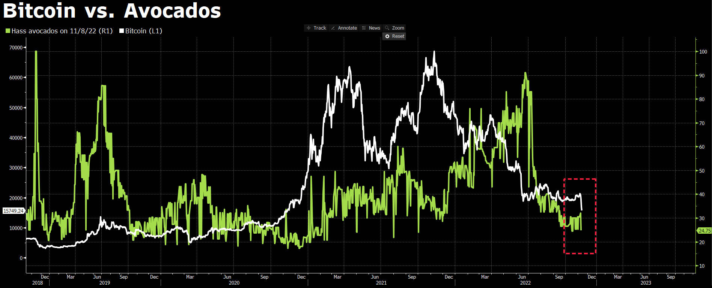

# Group Project 1

### Is Bitcoin truly an uncorrelated asset?

Bitcoin has sporadically tracked with various indexes since it's inception but it never seems to last. Our group wanted to examine these relationships by asking the question - does Bitcoin have any interesting price correlations with the Sp500, a tech ETF (IYW), gold, oil or..... avocados? Is it truly an uncorrelated asset? Could Google searches for Coinbase, Binance or Bitcoin be correlated?

### What do different Bitcoin correlation charts look like?

Ultimately, we are searching for a significant price change in Bitcoin that correlates to movements in other indexes, commodities or Google searches.

### Can correlation analysis give us any insight into whether Bitcoin returns are arbitary?

Modern portfolio theory demonstrates that adding an uncorrelated asset to a portfolio can improve returns and reduce risk. Are Bitcoin returns truly arbitrary and not related to the global economy? Do prices go up during broad speculative bubbles and down when those bubbles pop? Or is Bitcoin like gold, a value that's somewhat arbitrary and not tied to corporate earnings and central bank policy? Can something that is in limited supply be valuable just because people think it is?

(Provide a short description of what you found and any relevant plots under each heading)

## Project Repo Contents

* [Data](Data)
* [Images](Images)